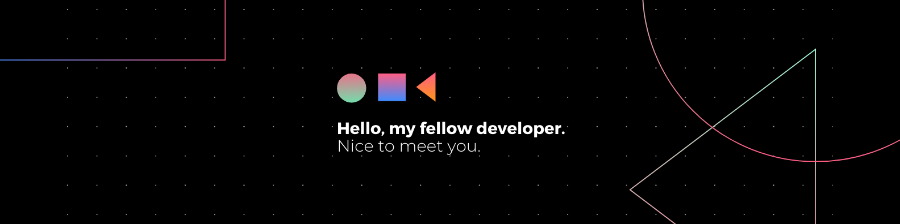

<h1 align="center">Hello, I'm Rion Talukder.</h1>

<h3 align="left">Person with a love for clean code and 🍵.</h3>

---

### About
- 😪 Currently into Full-stack Web Development and DevOps.

- 🤔 Ask me about Data Structures, Competitive Programming.

- 📫 You can reach me at **riontalukder98@gmail.com**
  
- ⚡ Fun fact **I'm a Photographer as well.**

### Connect with me:

 

##

### 
Languages & Tools I have worked with 👇🏼

  

---

  
  

